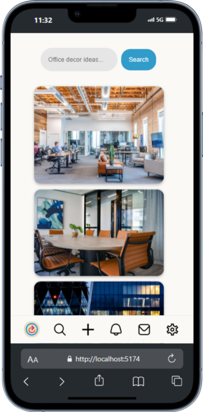
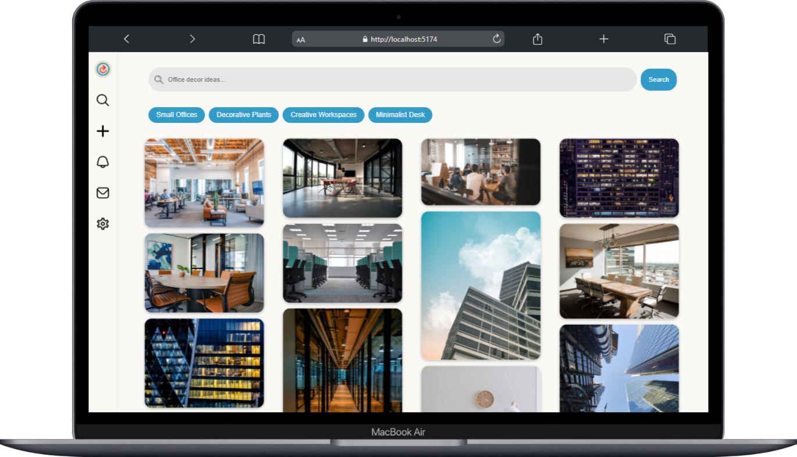

# Asyncterest - Galería de Fotos

Asyncterest es una galería de fotos interactiva construida con JavaScript y la API de **Unsplash**. Los usuarios pueden buscar imágenes o explorar utilizando filtros de categorías como **Oficinas**, **Plantas**, **Espacios de Trabajo**, entre otros. 

## Características

- **Búsqueda**: Los usuarios pueden buscar imágenes relacionadas con palabras clave.
- **Filtros de Categorías**: Filtros predefinidos como **Oficinas**, **Plantas**, **Espacios de Trabajo**, y más.
- **Paginación**: Las imágenes se cargan de forma dinámica al hacer scroll hacia abajo.
- **Interactividad**: La interfaz responde a las acciones del usuario, como la búsqueda y la selección de filtros.
- **Diseño Responsive**: Adaptado a dispositivos móviles, tabletas y escritorios.

  
   

## Tecnologías Utilizadas

<div align="center">

  <a href="https://developer.mozilla.org/en-US/docs/Web/HTML"></a>
  <a href="https://developer.mozilla.org/en-US/docs/Web/CSS"></a>
  <a href="https://developer.mozilla.org/en-US/docs/Web/JavaScript"></a>
  <a href="https://vitejs.dev/"></a>
  


</div>

## Instalación

Sigue estos pasos para configurar el proyecto en tu máquina local:

1. **Clona el repositorio**:
   ```bash
   git clone https://github.com/tu-usuario/asyncterest.git
   ```


   📄 Licencia

- Este proyecto está licenciado bajo la MIT License. Consulta el archivo [`LICENSE`](LICENSE) para más detalles.
